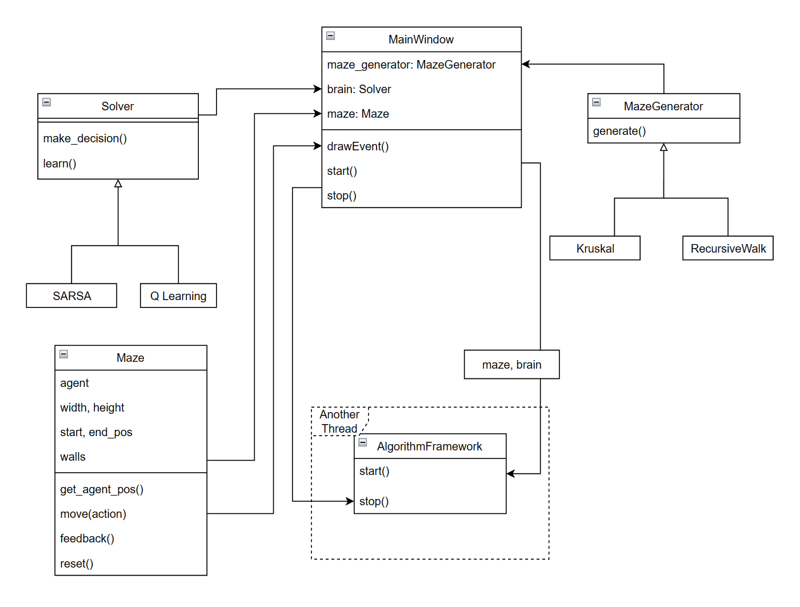

# RLM

Reinforcement Learning in Maze

## UML Class Diagram

## RL Algorithms

- [x] Q Learning
- [ ] SARSA
- [ ] Value Iteration
- [ ] Policy Iteration
- [ ] Evolution Strategies
- [ ] DQN
- [ ] A3C
- [ ] TRPO

## Maze Generator Algorithms

- [x] Kruskal Algorithm
- [x] Recursively Walk
- [ ] DFS
- [ ] Prim Algorithm
- [ ] Recursively Divide

## User Interface

- [x] Draw the maze
- [x] Select Button
- [x] Generate random
  - [x] with custom size
- [x] Show iteration times
- [ ] Stop Button
