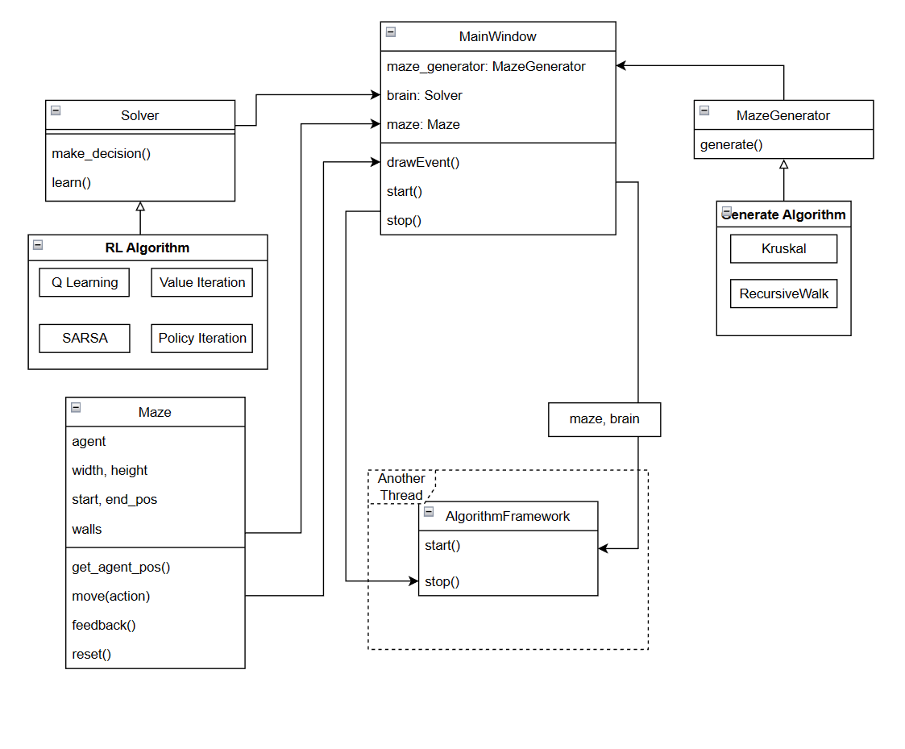

# RLM

Reinforcement Learning in Maze

EN | [中文](./docs/README_zh.md)

## Introduction

Maze problem in this repository means agent no nothing about maze, expect:

1. it's position
2. maze is square and has a approachable end
3. When agent touchs the wall or goes out bound, it dies and restart from start point.

This repo use some basic Reinforcement Learning Algorithms to solve this simple maze problem.

## UML Class Diagram

## Feature

### RL Algorithms

- [x] Q Learning
- [x] SARSA
- [x] Value Iteration
- [x] Policy Iteration

> It turns out that all these basic, no-neural-network-needed algorithms having almost same learning and decision making logic when we are doing optimization for each algorithm.

### Maze Generator Algorithms

- [x] Kruskal Algorithm
- [x] Recursively Walk
- [ ] DFS
- [ ] Prim Algorithm
- [ ] Recursively Divide

### User Interface

- [x] Draw the maze
- [x] Select Button
- [x] Generate random
  - [x] with custom size
- [x] Show iteration times
- [x] Show Solution
- [x] Stop Button
